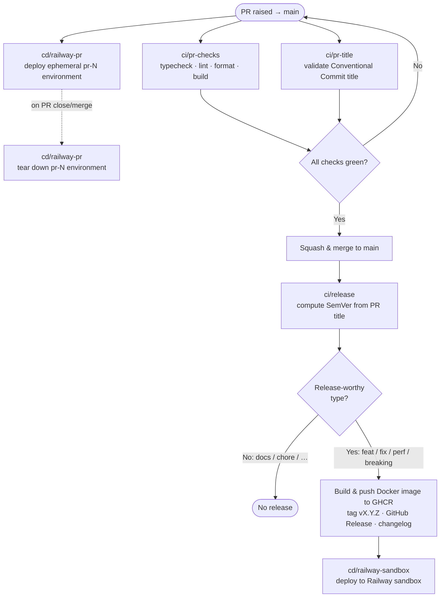
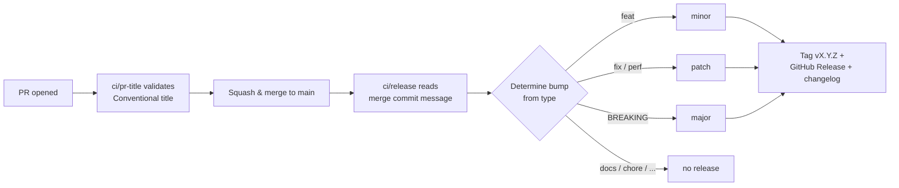

# Contributing to LiveMaid

Thank you for your interest in contributing! This document covers everything you need to get the project running locally, understand the workflow, and submit a pull request.

## Table of Contents

- [🚀 Getting Started](#-getting-started)
  - [Prerequisites](#prerequisites)
  - [Installation](#installation)
  - [Running the Development Server](#running-the-development-server)
- [🤝 Contribution Workflow](#-contribution-workflow)
- [✏️ Pull Request Titles](#️-pull-request-titles)
- [🔄 CI/CD Flow](#-cicd-flow)
  - [1) PR Raised](#1-pr-raised)
  - [2) PR Check](#2-pr-check)
  - [3) PR Preview Environment (Railway)](#3-pr-preview-environment-railway)
  - [4) Merge](#4-merge)
  - [5) Release](#5-release)
    - [Automatic versioning from the PR title](#automatic-versioning-from-the-pr-title)
  - [6) Sandbox Deployment](#6-sandbox-deployment)

## 🚀 Getting Started

Follow these instructions to set up the project locally for development.

### Prerequisites

- Node.js (v18 or higher recommended)
- npm (or yarn, pnpm, bun)

### Installation

Ensure you are in the project root directory:

```bash
cd livemaid
```

Install the dependencies:

```bash
npm install
```

### Running the Development Server

Start the local development server:

```bash
npm run dev
```

Open [http://localhost:3000](http://localhost:3000) with your browser to see the dashboard.

The application auto-updates as you edit the files in the `src/` directory.

## 🤝 Contribution Workflow

We follow a strict **Feature Branch Workflow** with **Squash and Merge**.

1. **Create a Feature Branch**: When starting a new epic or feature, branch off from `main` (e.g., `git checkout -b feature/your-epic-name`).
2. **Develop & Commit**: Make your changes and use Conventional Commits (e.g., `feat: ...`, `fix: ...`).
3. **Raise a Pull Request**: Once complete, raise a Pull Request targeting `main`. The **PR title must follow Conventional Commits** (see below) — because we squash and merge, the PR title becomes the commit message on `main`.
4. **Squash and Merge**: Merge the PR using the **"Squash and merge"** option. This keeps the `main` history perfectly clean with one commit per epic.

_(Note: PRs currently do not require a reviewer, but mandatory reviews will be enforced once there is more than one contributor)._

## ✏️ Pull Request Titles

PR titles are validated automatically by the `ci/pr-title` workflow and must follow the [Conventional Commits](https://www.conventionalcommits.org/) format: `<type>(optional scope): <description>`.

- **Allowed types:** `feat`, `fix`, `build`, `chore`, `ci`, `docs`, `style`, `refactor`, `perf`, `test`, `revert`.
- **Be concise and descriptive**, using the imperative mood and starting the description with a lowercase letter.
- **Reference issues** when applicable.

Examples:

- ✅ `feat: implement user profile view (closes #123)`
- ✅ `fix: resolve null pointer error in authentication module`
- ✅ `docs: update usage examples for API endpoints`
- ❌ `fix bug` (missing type, not descriptive)
- ❌ `feat: Add CSV export` (description should not start with an uppercase letter)

## 🔄 CI/CD Flow

This repository follows the pipeline below — from raising a PR through to the sandbox deployment:



### 1) PR Raised

- Open a pull request targeting `main`.

### 2) PR Check

Every PR must pass the following required checks before it can be merged:

| Check                              | Workflow / Job                          | What it enforces                                                                                                                           |
| ---------------------------------- | --------------------------------------- | ------------------------------------------------------------------------------------------------------------------------------------------ |
| **Type check**                     | `ci/pr-checks` → _Lint, format & types_ | TypeScript compiles with no type errors.                                                                                                   |
| **Lint**                           | `ci/pr-checks` → _Lint, format & types_ | ESLint reports no errors.                                                                                                                  |
| **Format check**                   | `ci/pr-checks` → _Lint, format & types_ | The tree is Prettier-formatted (run `npm run format` to fix drift).                                                                        |
| **Build**                          | `ci/pr-checks` → _Build_                | The production build succeeds.                                                                                                             |
| **PR title (Conventional Commit)** | `ci/pr-title`                           | PR title follows Conventional Commits via [`amannn/action-semantic-pull-request`](https://github.com/amannn/action-semantic-pull-request). |

> 💡 Run `npm run prepush` locally before pushing to run all four checks (typecheck, lint, format check, build) and catch failures early.

### 3) PR Preview Environment (Railway)

- Workflow: `cd/railway-pr` (`.github/workflows/railway-deploy-pr.yml`)
- Trigger: `pull_request` (opened / synchronize / reopened / closed)
- Action: spins up an ephemeral Railway environment named `pr-<number>` (duplicating the base environment's config and variables), deploys the branch to it, and posts the preview URL as a sticky comment on the PR. The environment is re-deployed on every push and **destroyed automatically when the PR is closed or merged**.

| Aspect            | Behaviour                                                                              |
| ----------------- | -------------------------------------------------------------------------------------- |
| Enabled           | Opt-in: only runs when `vars.RAILWAY_PR_PREVIEWS` is `true`; otherwise both jobs skip. |
| Environment       | `pr-<number>`, duplicated from `vars.RAILWAY_BASE_ENVIRONMENT` (default `production`). |
| Created / updated | On `opened`, `reopened`, and every `synchronize` (push).                               |
| Destroyed         | On `closed` (covers both merge and discard).                                           |
| Forked PRs        | Skipped — repository secrets are not exposed to PRs from forks.                        |

> ⚙️ Disabled by default. To enable, set repository variable `RAILWAY_PR_PREVIEWS` to `true` and provide secrets `RAILWAY_API_TOKEN` (account/workspace token, needed to create & delete environments) and `RAILWAY_PROJECT_ID`; optional variables `RAILWAY_SERVICE` (defaults to the repo name) and `RAILWAY_BASE_ENVIRONMENT` (defaults to `production`).

### 4) Merge

- Merge PR into `main` (squash and merge).

### 5) Release

- Workflow: `ci/release` (`.github/workflows/docker-publish.yml`)
- Trigger: `push` to `main`
- Action: derives the next [SemVer](https://semver.org/) version from the squashed merge commit (the PR title), builds and publishes the Docker image to GHCR, then creates a GitHub Release tagged `vX.Y.Z`.

#### Automatic versioning from the PR title

Because we **squash and merge**, the PR title — already validated by `ci/pr-title` to be a Conventional Commit — becomes the single commit message on `main`. The `ci/release` workflow reads that commit's `type` and bumps the version accordingly, then tags, releases, and generates a changelog automatically. No manual version bumping required.

| PR title prefix                                                               | SemVer bump           | Example: `1.4.2` → |
| ----------------------------------------------------------------------------- | --------------------- | ------------------ |
| `fix:`, `perf:`                                                               | **patch**             | `1.4.3`            |
| `feat:`                                                                       | **minor**             | `1.5.0`            |
| `feat!:` / `<type>!:` / `BREAKING CHANGE`                                     | **major**             | `2.0.0`            |
| `docs:`, `chore:`, `ci:`, `style:`, `refactor:`, `test:`, `build:`, `revert:` | **none** (no release) | `1.4.2`            |



The new version is computed from the latest existing `vX.Y.Z` git tag (defaulting to `v0.0.0` when none exist), so releases stay continuous across merges.

### 6) Sandbox Deployment

- Workflow: `cd/railway-sandbox` (`.github/workflows/railway-deploy-sandbox.yml`)
- Trigger: successful completion of `ci/release` (`workflow_run`)
- Action: deploys latest release to Railway sandbox service.
